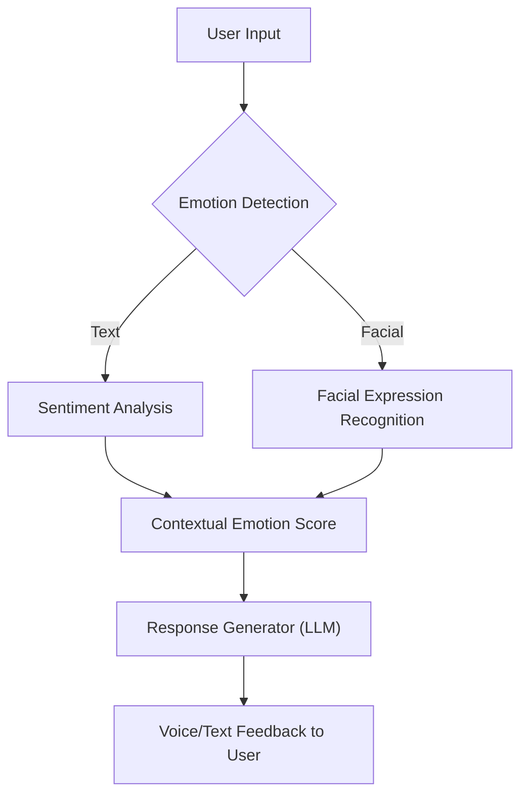

# 🤖 Emotionally Intelligent Therapist

The **Emotionally Intelligent Therapist** is an AI-driven virtual therapy project that leverages emotional intelligence to provide adaptive, empathetic support through text, facial emotion detection, and machine learning. This solution blends psychology with AI to improve mental wellness, promote mindfulness, and track emotional health over time.

---

## 📽️ Demo Video

> 🎬 Watch the full video demo:  
[](https://www.youtube.com/watch?v=YourVideoID)

---

## 🧠 Key Features

- 🧠 **Emotion Detection** via text and facial expressions  
- 💬 **Sentiment-Aware Chat** using advanced LLMs  
- 📈 **Visual Tracking** of user emotions across sessions  
- 🧘‍♂️ **Personalized Therapy Prompts** (e.g. CBT, mindfulness)  
- 🔒 **Private & Secure** user data handling  

---

## 📊 System Architecture


## 🎨 Visual Data Insights

### 📈 Emotion Trend Line Graph  
Shows how emotional responses vary weekly.  
**INSERT IMAGE (emotional_trends.png)**

---

### 🔥 Heatmap of Emotional Shifts  
Highlights intensity of emotions across 5 weeks.  
**INSERT IMAGE (emotional_heatmap.png)**

---

### 🥧 Average Emotional Distribution (Pie Chart)  
Visual summary of the user’s average emotional states.  
**INSERT IMAGE (average_emotion_pie_chart.png)**

---

## 🧪 Tech Stack

| Category      | Technology                          |
|---------------|-----------------------------------|
| Frontend      | React.js, WebRTC                  |
| Backend       | Python, Flask / FastAPI           |
| NLP / AI      | OpenAI GPT, HuggingFace Transformers |
| ML Models     | BERT, CNN (for facial recognition)|
| Visualization | Matplotlib, Seaborn, D3.js        |
| Deployment    | Docker, Heroku / Vercel           |

---

## 🚀 Getting Started

### Prerequisites

- Python 3.10+  
- Node.js & npm  
- OpenAI API Key

## Setup Instructions

```bash
git clone https://github.com/yourusername/emotionally-intelligent-therapist.git
cd emotionally-intelligent-therapist

# Backend
pip install -r requirements.txt

# Frontend
cd frontend
npm install
```


## 🎯 Use Cases

- Virtual therapists & wellness coaches  
- Pre-diagnostic emotional screening  
- Mental health tracking dashboards  
- Emotionally responsive chatbots  

---

## 🔮 Future Enhancements

- Voice tone emotion analysis  
- Real-time multi-modal feedback  
- Wearable integration (HRV, EEG)  
- Multi-language support  

---

## 🤝 Contributing

Pull requests are welcome!

To contribute:

1. Fork the repository  
2. Create a feature branch (`git checkout -b feature-name`)  
3. Commit your changes  
4. Push to your branch  
5. Open a Pull Request  
## 📃 License

This project is licensed under the MIT License. See the [LICENSE](LICENSE) file for details.

---

## 📫 Connect With Me

- 🌐 Website: [yourwebsite.com](https://yourwebsite.com)  
- 📨 Email: yourname@example.com  
- 🔗 LinkedIn: [linkedin.com/in/your-profile](https://www.linkedin.com/in/piyushjoshi0303/)
